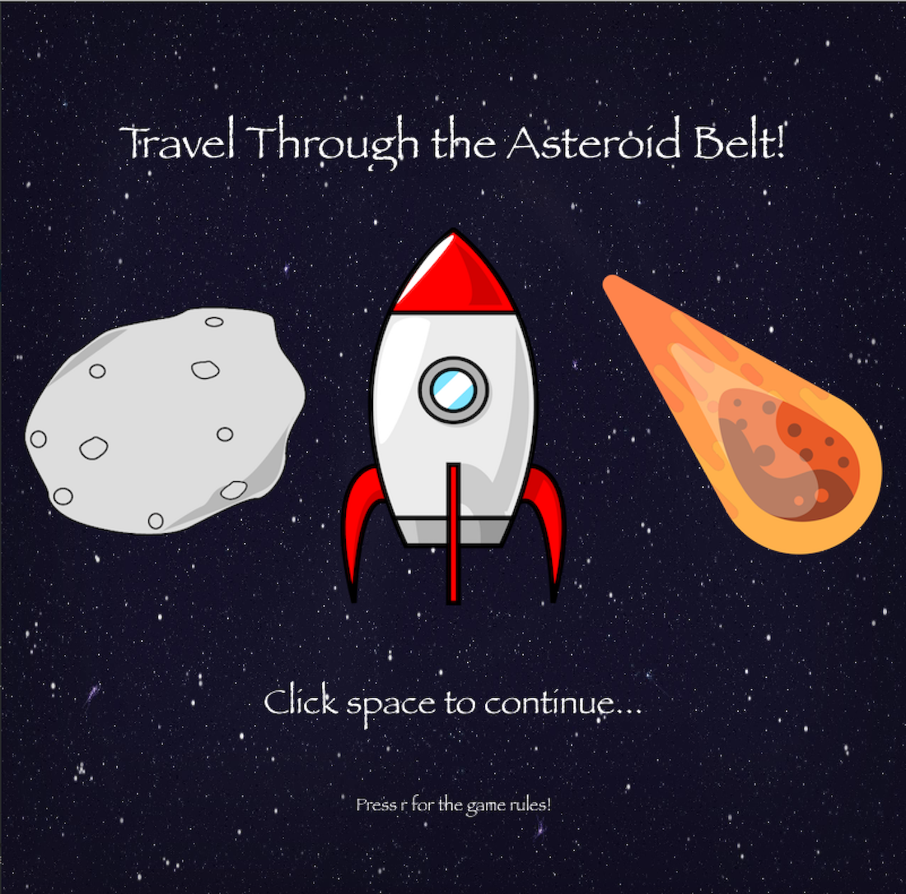
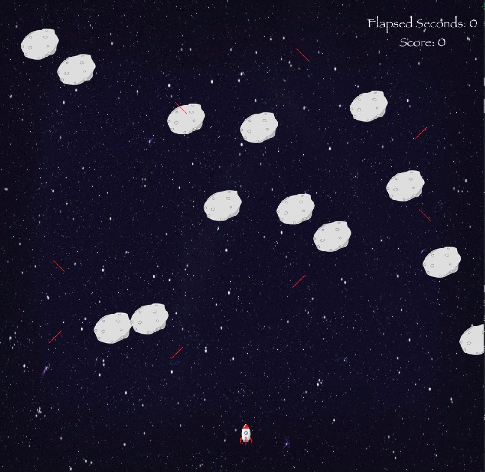
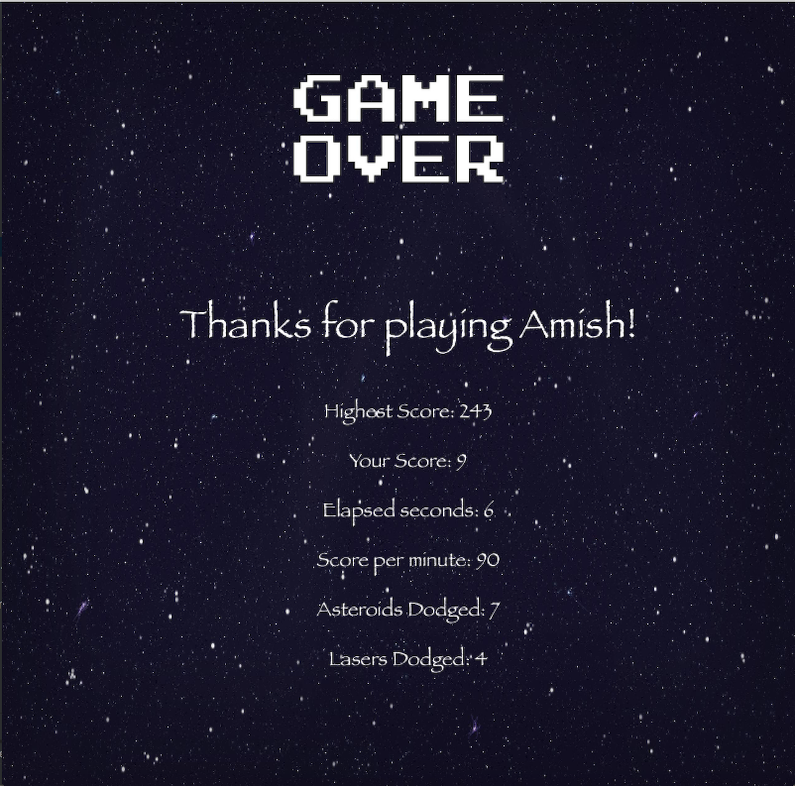

# Travel Through the Asteroid Belt!







[](LICENSE)
[](docs/README.md)

Read [this document](https://cliutils.gitlab.io/modern-cmake/chapters/basics/structure.html) to understand the project
layout.

**Author**: - [adara2@illinois.edu]

## Introduction
The Asteroid Belt is a region between Jupiter and Mars that
contains interstellar matter and millions of (you guessed it)
ASTEROIDS! This program allows players to travel through the 
asteroid belt in a spaceship, avoiding high-speed asteroids 
and lasers hurling towards them.
## Prerequisites
- An IDE that supports C++ (CLion recommended) 
- The cinder framework which can be downloaded here: https://libcinder.org/

## Installation
- Use this guide to integrate CMake: https://courses.grainger.illinois.edu/cs126/sp2020/notes/cmake/
- Download this repository
- Type in player name in the command line and run the program:
```console
-name [Your-Name]
```


## Libraries
- sqlite-modern-cpp: https://github.com/SqliteModernCpp/sqlite_modern_cpp
- sqlite3: https://github.com/mackyle/sqlite
- gflags: https://github.com/gflags/gflags

## Rules and Controls
### Rules
- The rules are pretty simple: dodge the asteroids and lasers!
- The longer you survive and the harder the difficulty you play on, the higher your score will be!


### Controls
| Key       | Action                                                      |
|---------- |-------------------------------------------------------------|
| `A`       | Move to the left                                           |
| `D`       | Move to the right                                            |
| `W` | Move up                                                        |
| `S`       | Move down                                          |
| `e, m, h` | Toggle difficulty between easy, medium, or hard difficulties  |


